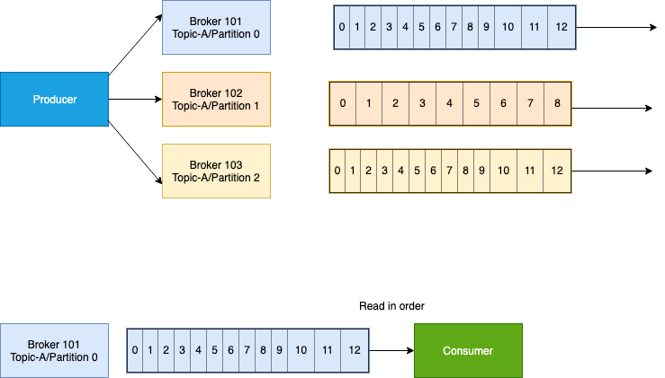
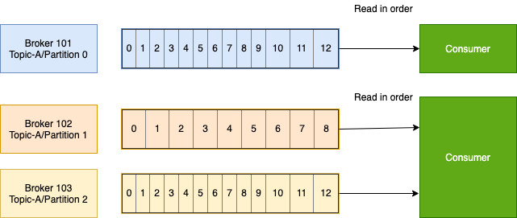
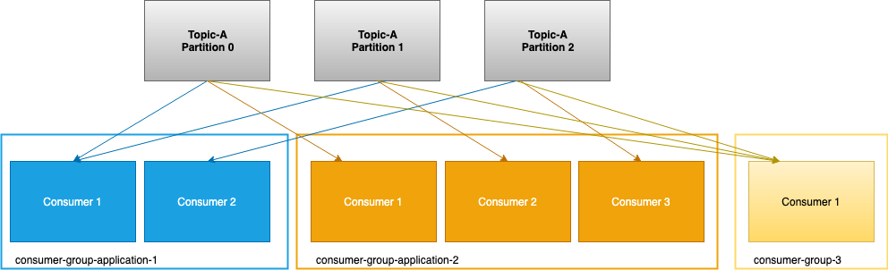
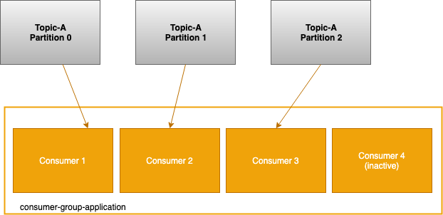
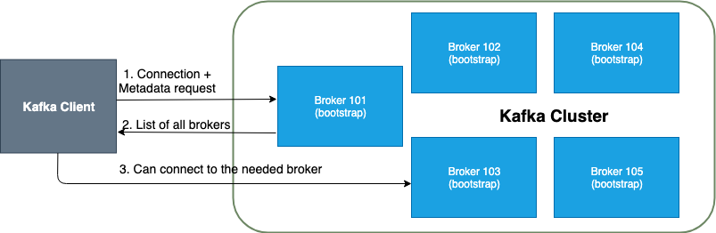
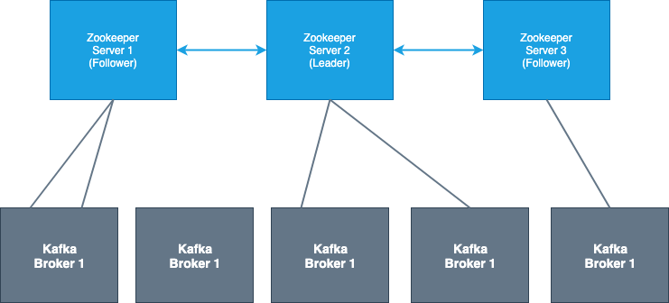
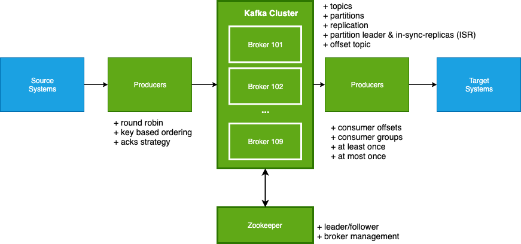

## Kafka basics
_Based on Stephane Maarek: Apache Kafka Series - Learn Apache Kafka for Beginners_

### Topics, partitions and offsets

#### Topics
- similar to a table in a database (without al the constraints)
- you can have as many topics as you'd like
- a topic is identified by its name
- topics are split into partitions

#### Partitions
- each partition is ordered
- each message within a partition gets an incremental id, called offset

#### Offsets
- an offset is bound to a specific partition; in other words an offset is bound to a specific partition
- order is guaranteed only within the partition but not across partitions

#### Data
- is kept for a limited time (default is one week)
- once the data is written to a partition, it cannot be changed (immutability)
- data is assigned randomly to a partition unless a key is provided

### Brokers

- a Kafka cluster is composed of multiple brokers (servers)
- each broker is identified by its ID (integer)
- each broker contains certain topic partitions - but not all the data
- after connecting to any broker (called a bootstrap broker), you will be connected to the entire cluster
- a good number cluster number to start with is 3; some clusters can grow in the hundreds
- to make it easy for growth, name clusters starting at 100 (example, 101, 102, 103)

#### Brokers and Topics

- example of Topic-A with 3 partitions
- example of Topic-B with 2 partitions

| Broker 101          |      Broker 102     |          Broker 103 |
|---------------------|:-------------------:|--------------------:|
| Topic-A Partition-0 | Topic-A Partition 2 | Topic-A Partition 1 |
| Topic-B Partition 1 | Topic-B Partition 0 |                     |

- **Note**: Data is distributed and Broker 103 does not have any Topic B data

##### Topic replication factor

- topics should have a replication factor > 1 (usually between 2 and 3)
- replication factor gold standard is 3 while two is a bit risky
- this way if a broker is down, another broker can serve the data
- example: Topic-A with two partitions and replication factor of two

| Broker 101          |         Broker 102        |                Broker 103 |
|---------------------|:-------------------------:|--------------------------:|
| Partition-0 Topic-A | Partition 1 Topic-A       | Repl: Partition 1 Topic-A |
|                     | Repl: Partition 0 Topic-A |                           |

- if we lose Broker 102
- broker 101 and 103 can still serve the data

##### Concept of Leader for a Partition

- only one broker can be a leader for a given partition
- only that leader can receive and serve data for a partition
- the other brokers will synchronize the data
- therefore, each partition has one leader and multiple ISR (in-sync replica)

| Broker 101                     |            Broker 102           |                      Broker 103 |
|--------------------------------|:-------------------------------:|--------------------------------:|
| * Partition-0 Topic-A (leader) | * Partition 1 Topic-A (Leader)  | Repl: Partition 1 Topic-A (ISR) |
|                                | Repl: Partition 0 Topic-A (ISR) |                                 |

### Producers

- how do we get data into Kafka - enter the producers
- producers write data to topics (which are made of topics)
- producers automatically know to which broker and partition to write to
- in case of broker failures, Producers will automatically recover

**Note** The load is balanced to many brokers thanks to the number of partitions

* producers can choose to receive acknowledgements of data writes (send modes below)
 * `acks=0`: producer won't wait for acknowledgement (possible data loss)
 * `acks=1`: producer will wait for leader acknowledgement (limited data loss) [default]
 * `acks=all`: leader + replicas acknowledgement (no data loss)

#### Producers: Message keys

- producers can choose to send a **key** with the message (string, number, etc.)
- if the key is not sent; if `key=null`, data is sent round robin (broker 101, then 102, then 103...)
- if a key is sent, then all messages for that key will always go to the same partition (this is a Kafka guarantee)
- a key is basically sent if you need message ordering for a specific field (ex: truck_id)
- for example when sending
 - key: truck_id_123 data will always be sent to partition 0
 - key: truck_id_234 data will always be sent to partition 0
 - key: truck_id_345 data will always be sent to partition 1
 - key: truck_id_456 data will always be sent to partition 1
- so we do not refer to which partition the key will go to, but it is guaranteed to go to the same partition
- this is referred to as key hashing: an advanced topic and it depends on the number of partitions

### Consumers

- Consumers read data from a topic (identified by name)
- Consumers know which broker to read from
- In case of broker failures, consumers know how to recover
- Data will be read in order **within each partition**

#### Consumer groups

- consumers read data in consumer groups
- each consumer within a group reads from exclusive partitions
- if you have more consumers than partitions, some consumers will be inactive

**Note:** Consumers will automatically use a GroupCoordinator and a ConsumerCoordinator to assign a consumer to a partition

#### What if you have too many Consumers

- If you have more consumers than partitions, some consumers will be inactive

- you usually add inactive/redundant consumers if you anticipate being shut down
- usually you have as many consumers as there are partitions; this is why you need to make the partition decision ahead of time
- if you plan to have a high number of consumers, you need to have a high number of partitions
- in our example we have three partitions so we can only have up to 3 consumers

#### Consumer Offsets

- Kafka stores the offsets where a consumer group reads
- think of this as checkpointing or bookmarking
- the offsets are committed live in a Kafka topic named `__consumer_offsets`
- when a consumer in a group has processed data received from Kafka, it should be committing the offsets
- this is done because when a consumer quits unexpectedly, upon restart it will be able to read back from where it left off; thanks to the committed consumer offsets

#### Delivery semantics for consumers

- consumers chose when to commit offsets
- there are 3 delivery semantics
- `at most once`
 - offsets are committed as soon as the message is received
 - if something goes wrong, the message will be lost (it won't be read again)
- `at least once` (preferred)
 - offsets are committed after the message is processed
 - if something goes wrong, the message will be read again
 - this can result in duplicate processing of messages. Make sure your processing is **idempotent** (i.e. subsequent message processing will not affect your systems)
- `exactly once`
 - can be achieved for Kafka to Kafka workflows using Kafka Streams API

### Kafka Broker Discovery

- every Kafka broker is also called a "bootstrap server"
- this means **you only need to connect to one broker** and you be connected to the entire cluster
- each broker knows about all brokers, topics and partitions (metadata)

### Zookeeper

- Zookeeper manages brokers (keeps a list of them)
- Zookeeper helps in performing leader election for partitions
- Zookeeper sends notifications to Kafka in case of changes (e.g new topic, broker down, broker up, delete topics, etc.)
- **Kafka cannot work without Zookeeper**
- Zookeeper, by design, operates with an odd number of servers (3, 5, 7...)
- Zookeeper has a leader (handles writes) the rest of the servers are followers (handle reads)
- Zookeeper does not store consumer offsets with Kafka > v0.10

### Kafka Guarantees

- Messages are appended to a topic partition in the order they are sent
- Consumers read messages in the order stored in a topic-partition
- With a replication factor of N, producers and consumers can tolerate up to N - 1 brokers being down
- This is why a replication factor of 3 is a good idea:
 - allows for one broker to be taken down for maintenance
 - allows for another broker to be taken down unexpectedly
- as long as the number of partitions remains constant for a topic (no new partitions), the same key will always go to the same partition

### Theory Roundup

