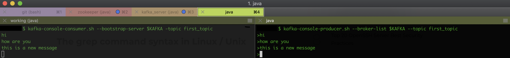

## Kafka Console Consumer

### Consuming topics

- the command for this is `kafka-console-consumer.sh`
- as you type this command without any options, look for **REQUIRED** arguments
  - `--bootstrap-server <String: server to    REQUIRED: The server(s) to connect to.`

```bash
# Remember we set our bootstrap server into an environment variable named KAFKA
kafka-console-consumer.sh --bootstrap-server $KAFKA -topic first_topic

kafka-console-consumer.sh --bootstrap-server $KAFKA --topic twitter_tweets
```
- you will notice that the consumer does not read all the topics prior to its launch
- the console consumer will only read topics after it was launched and will only intercept new messages
- lets look at the interaction between the producer and consumer



#### How to consume all the topics

- add `--from-beginning` param to the `kafka-console-consumer`
```bash
kafka-console-consumer.sh --bootstrap-server $KAFKA -topic first_topic --from-beginning
```
```bash
$ kafka-console-consumer.sh --bootstrap-server $KAFKA -topic first_topic --from-beginning
lo
how are you
Another hello
message is acked
this is a new message
Hello world
one more message :)
another acked message
hi
```
- note the order is per partition. `first_topic` has 3 partitions - so the order is per partitions as explained in [Kafka Basics](KafkaBasics.md) - what you see is total ordering

### Kafka Consumers in Group

- add the `--group` command line option

```bash
# Remember we set our bootstrap server into an environment variable named KAFKA
kafka-console-consumer.sh --bootstrap-server $KAFKA -topic first_topic --group my-app-group
```
- what you should observe, is what happens when you start subsequent consumers in the same group
- the messages will not be sent to the same consumer all the time; messages will be shared between all consumers registered in the same group. We have 3 partitions and 2 console consumers. Consumers are automatically balanced to share the load. If one consumer goes down messages are rebalanced between the remaining consumers.

#### Subsequent group reads

- let's say you want to read from a group from the beginning.

```bash
kafka-console-consumer.sh --bootstrap-server $KAFKA -topic first_topic --from-beginning -group my-second-app-group
```
- as you'd expect, all the messages will print from the beginning.
- but what happens if you reissue that command? will all the messages `--from-beginning` be printed? The answer is no. That is because all we used the `--group` option the offsets have been committed by Kafka. So from now on, only the new messages will be read.
- so you can start the console consumer with the `--group` option and the new messages will be read even if the console consumer was not running when the messages were sent.

```bash
kafka-console-consumer.sh --bootstrap-server $KAFKA -topic first_topic --group my-second-app-group
```

### `kafka-consumer-groups.sh` command
From CLI help. This tool helps to list all consumer groups, describe a consumer group, delete consumer group info, or reset consumer group offsets.

#### list groups

```bash
$ kafka-consumer-groups.sh --bootstrap-server $KAFKA --list

my-app-group
```

#### describe groups

```bash
$ kafka-consumer-groups.sh --bootstrap-server $KAFKA --describe --group my-app-group
Consumer group 'my-app-group' has no active members.

TOPIC           PARTITION  CURRENT-OFFSET  LOG-END-OFFSET  LAG             CONSUMER-ID     HOST            CLIENT-ID
first_topic     0          4               4               0               -               -               -
first_topic     1          5               5               0               -               -               -
first_topic     2          6               6               0               -               -               -
```
- `Consumer group 'my-app-group' has no active members.` - this means there are no active consumers
- let's look at a group that has lag messages

```bash
$ kafka-consumer-groups.sh --bootstrap-server $KAFKA --describe --group my-second-app-group
Consumer group 'my-second-app-group' has no active members.

TOPIC           PARTITION  CURRENT-OFFSET  LOG-END-OFFSET  LAG             CONSUMER-ID     HOST            CLIENT-ID
first_topic     0          5               6               1               -               -               -
first_topic     1          5               6               1               -               -               -
first_topic     2          7               7               0               -               -               -
```

- ^ we can see that some messages have not been read; in this case two messages
- if we read the messages and run describe again; we can see the LAG is no set to 0; we're all caught up

```bash
$ kafka-consumer-groups.sh --bootstrap-server $KAFKA --describe --group my-second-app-group
Consumer group 'my-second-app-group' has no active members.

TOPIC           PARTITION  CURRENT-OFFSET  LOG-END-OFFSET  LAG             CONSUMER-ID     HOST            CLIENT-ID
first_topic     0          6               6               0               -               -               -
first_topic     1          6               6               0               -               -               -
first_topic     2          7               7               0               -               -               -
```
- now, let's run a describe a group with at least one registered consumer

```bash
$ kafka-consumer-groups.sh --bootstrap-server $KAFKA --describe --group my-second-app-group

TOPIC           PARTITION  CURRENT-OFFSET  LOG-END-OFFSET  LAG             CONSUMER-ID                                     HOST            CLIENT-ID
first_topic     0          7               7               0               consumer-1-30d24b0c-cedf-4e1f-85a3-745ab7d3bef2 /10.0.1.34      consumer-1
first_topic     1          6               6               0               consumer-1-30d24b0c-cedf-4e1f-85a3-745ab7d3bef2 /10.0.1.34      consumer-1
first_topic     2          8               8               0               consumer-1-30d24b0c-cedf-4e1f-85a3-745ab7d3bef2 /10.0.1.34      consumer-1
```
- ^ as you can see, now we can identify where the consumers are located, their client-id, and what partition they are allocated

### Resetting Offsets

- the question is, how do I make consumers replay the data when the offsets have been already set?
- run `kafka-consumer-groups.sh` with `--reset-offsets` option

```
--reset-offsets                         Reset offsets of consumer group.
                                          Supports one consumer group at the
                                          time, and instances should be
                                          inactive
                                        Has 2 execution options: --dry-run
                                          (the default) to plan which offsets
                                          to reset, and --execute to update
                                          the offsets. Additionally, the --
                                          export option is used to export the
                                          results to a CSV format.
                                        You must choose one of the following
                                          reset specifications: --to-datetime,
                                          --by-period, --to-earliest, --to-
                                          latest, --shift-by, --from-file, --
                                          to-current.
                                        To define the scope use --all-topics
                                          or --topic. One scope must be
                                          specified unless you use '--from-
                                          file'.
```

```
--shift-by <Long: number-of-offsets>    Reset offsets shifting current offset
                                          by 'n', where 'n' can be positive or
                                          negative.
```

```
--to-current                            Reset offsets to current offset.
--to-datetime <String: datetime>        Reset offsets to offset from datetime.
                                          Format: 'YYYY-MM-DDTHH:mm:SS.sss'
--to-earliest                           Reset offsets to earliest offset.
--to-latest                             Reset offsets to latest offset.
--to-offset <Long: offset>              Reset offsets to a specific offset.
```

```
kafka-consumer-groups.sh --bootstrap-server $KAFKA --group my-app-group --reset-offsets --to-earliest

WARN: No action will be performed as the --execute option is missing.In a future major release, the default behavior of this command will be to prompt the user before executing the reset rather than doing a dry run. You should add the --dry-run option explicitly if you are scripting this command and want to keep the current default behavior without prompting.
One of the reset scopes should be defined: --all-topics, --topic.
```

- what went wrong?
- let's add the `--execute`

```
kafka-consumer-groups.sh --bootstrap-server $KAFKA --group my-app-group --reset-offsets --to-earliest --execute

One of the reset scopes should be defined: --all-topics, --topic.
```

- what went wrong?
- we must specify the topic we want to reset (or all topics)

```
kafka-consumer-groups.sh --bootstrap-server $KAFKA --group my-app-group --reset-offsets --to-earliest --execute --topic first_topic

TOPIC                          PARTITION  NEW-OFFSET
first_topic                    0          0
first_topic                    2          0
first_topic                    1          0
```
- success; by specifying the topic, we were able to reset the offsets; in this case to 0 (the earliest in this case)
- restarting the consumer will read all the messages from the beginning

- let's shift offsets

```
$ kafka-consumer-groups.sh --bootstrap-server $KAFKA --group my-app-group --reset-offsets --shift-by 2 --execute --topic first_topic
Error: Assignments can only be reset if the group 'my-app-group' is inactive, but the current state is Stable.
```

- what went wrong?
- it appears we have to shut down our active consumers as shifting cannot be achieved while consumers are running

```
kafka-consumer-groups.sh --bootstrap-server $KAFKA --group my-app-group --reset-offsets --shift-by 2 --execute --topic first_topic

[2019-06-03 16:54:22,784] WARN New offset (9) is higher than latest offset for topic partition first_topic-0. Value will be set to 7 (kafka.admin.ConsumerGroupCommand$)
[2019-06-03 16:54:22,784] WARN New offset (10) is higher than latest offset for topic partition first_topic-2. Value will be set to 8 (kafka.admin.ConsumerGroupCommand$)
[2019-06-03 16:54:22,784] WARN New offset (8) is higher than latest offset for topic partition first_topic-1. Value will be set to 6 (kafka.admin.ConsumerGroupCommand$)
```

- what went wrong?
- we were shifting forward; we must use negative numbers to shift backward

```
kafka-consumer-groups.sh --bootstrap-server $KAFKA --group my-app-group --reset-offsets --shift-by -2 --execute --topic first_topic

TOPIC                          PARTITION  NEW-OFFSET
first_topic                    0          5
first_topic                    2          6
first_topic                    1          4
```

- ^ it worked this time
