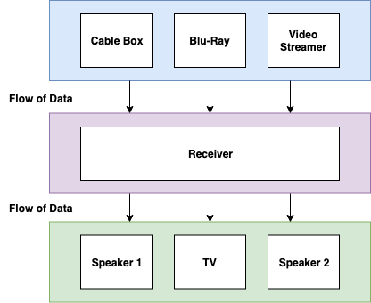
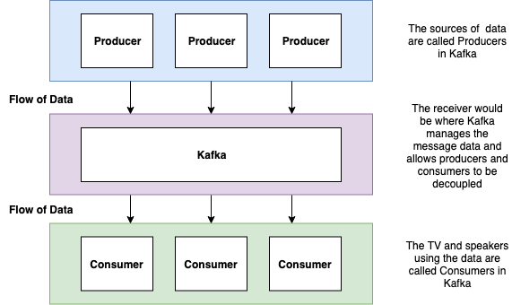

# Kafka Series
## Kafka introduction

Full tutorial: [https://github.com/springzen/Kafka-Series](https://github.com/springzen/Kafka-Series)

---

# Kafka

>Beyond a certain point there is no return. This point has to be reached.
– Franz Kafka

---

# Agenda
- What is Kafka
- Why use Kafka
- Short overview of the tutorial available online
- Short demo Kafka -> command line as well as Java

---

# What is Kafka
- a distributed streaming platform that has three main capabilities
  - provide the ability to publish/subscribe to records like a message queue
  - store records with fault tolerance
  - process streams in real time

---

# What are message queues

- If you are not familiar with Message Queues or Message Brokers let's look at generalized concept; a home entertainment system

---
# Message broker generalization

---

# What are message queues

* central receiver explained
  * Cable Box, Blu-Ray and Video Streamer - Constantly send data in the format they know about and unless there are any issues that flow of data can be thought of as near constant while the movie is playing
  * the receiver deals with this constant stream and is able to convert it into an usable format for the attached devices (i.e. receiver sends the video to the TV and the sound to the speakers)

---

Kafka broker generalization

---

# Messaging in a nutshell
>Wikipedia asserts that a message broker “translates a message from the formal messaging protocol of the sender to the formal messaging protocol of the receiver”.
.
>Ref: [Wikipedia via Introduction to Message Brokers: Part 1: Apache Kafka vs RabbitMQ](https://hackernoon.com/introduction-to-message-brokers-part-1-apache-kafka-vs-rabbitmq-8fd67bf68566)

---

## When a message broker is needed?

1. If you want to control data feeds. For example, the number of registrations in any system.
2. When the task is to put data to several applications and avoid direct usage of their API.
3. The necessity to complete processes in a defined order like a transactional system. See: [Pattern: Saga
](https://microservices.io/patterns/data/saga.html)

>Ref: [Introduction to Message Brokers: Part 1: Apache Kafka vs RabbitMQ](https://hackernoon.com/introduction-to-message-brokers-part-1-apache-kafka-vs-rabbitmq-8fd67bf68566)

---

# Message brokers summarization

So, we can say that message brokers can do 4 important things:

* divide the publisher and consumer
* store the messages
* route messages
* check and organize messages

---

## What is Kafka: What does Kafka do

* Kafka has the concepts of sending data from various sources of information and introducing them into Kafka called Producers.
* Kafka, as other message brokers do, acts, in reductionist terms, as a middle man to data coming into the system (from producers) and out of the system (via Consumers).
* This producer/consumer separation leads to loosely coupled components. The producer can send messages without having any dependency on consumers.

---

---

# Kafka Pros (brief)
* Easy to pick up
* Powerful event streaming platform
* Fault-tolerance and reliable solution
* Good scalability
* Free community distributed product
* Multi-tenancy
* Suitable for real-time processing
* Excellent for big data projects

---

# Kafka Cons (brief)
* Lack of ready to use elements
* The absence of complete monitoring set
* Dependency on Apache Zookeeper

---

# Kafka is able to:
1. publish and subscribe to streams of records with excellent scalability and performance, which makes it suitable for company-wide use.
2. durably store the streams, distributing data across multiple nodes for a highly available deployment.
3. process data streams as they arrive, provide ways to aggregate messages, perform joins of data within a stream, etc.

---

# Kafka key terms and concepts

---

# Kafka key concepts

* topics (the stored streams of records)
* records (they include a key, a value, and a timestamp)
* APIs (Producer API, Consumer API, Streams API, Connector API)

---

# Kafka working principle
* There are 2 main patterns of messaging:
  * queuing
  * publish-subscribe

---

## Kafka Message Delivery Semantics
[Message Delivery Semantics](https://kafka.apache.org/documentation/#semantics)

Kafka offers various ways to deliver messages.
- at least once semantics
- at most once semantics
- exactly once semantics

---

# At least once (default)

* if a message from a Producer failed or it's not acknowledged, the producer resends the message. One of the safest methods for sending messages via Kafka.
* the broker will see two messages (or one if there was a failure)
* consumers will receive as many messages as the broker received. Deduplication must be handled.

---

# At most once

* if a message from a Producer has a failure or it's not acknowledged, the producer will not resend the message
* the broker will see one message at most (or zero if there was a failure)
* consumers will see the messages the broker receives. The consumer will never see failed messages
* this semantic is useful when tracking website visitors. I this case a certain level of failed messages is acceptable

---

# Exactly once
>this is what people actually want, each message is delivered once and only once.

* if a message from a Producer has a failure or it's not acknowledged, the producer will resend the message
* the broker will only allow one message
* consumers will only see the message once
* [Kafka Exactly Once Semantics](https://hevodata.com/blog/kafka-exactly-once/)

---

## The many faces of Kafka
Ref: [The Kafka API Battle: Producer vs Consumer vs Kafka Connect vs Kafka Streams vs KSQL !](https://medium.com/@stephane.maarek/the-kafka-api-battle-producer-vs-consumer-vs-kafka-connect-vs-kafka-streams-vs-ksql-ef584274c1e)
* **Kafka Producer API**: Applications directly producing data (ex: clickstream, logs, IoT).
* **Kafka Connect Source API**: Applications bridging between a datastore we don’t control and Kafka (ex: CDC, Postgres, MongoDB, Twitter, REST API).
* **Kafka Streams API / KSQL**: Applications wanting to consume from Kafka and produce back into Kafka, also called stream processing. Use KSQL if you think you can write your real-time job as SQL-like, use Kafka Streams API if you think you’re going to need to write complex logic for your job.
* **Kafka Consumer API**: Read a stream and perform real-time actions on it (e.g. send email…)
* **Kafka Connect Sink API**: Read a stream and store it into a target store (ex: Kafka to S3, Kafka to HDFS, Kafka to PostgreSQL, Kafka to MongoDB, etc.)

---

## Why Kafka
* data parallelism
* distributed coordination
* fault tolerance
* operational simplicity
* another benefit, which is common, when using a message broker is the ability to handle consumer failures (i.e. application failures)
  * the producer does not need to wait the consumer to handle the message
  * when consumers restart to process data, they should be able to pickup where they left off and not drop messages

>[Apache Kafka: Architecture](https://kafka.apache.org/23/documentation/streams/architecture)
---

## Why the need for Kafka

* replication and fault tolerance by default
* millions of messages per second
* Developers
  * Java developers can integrate with Kafka through [Spring-Kafka](https://spring.io/projects/spring-kafka)
  * Ruby developers can integrate with Kafka through [Karafka](https://github.com/karafka/karafka) or [ruby-kafka
](https://github.com/zendesk/ruby-kafka)
  * decoupling -> eliminating tightly coupled implementations
  * language agnostic messaging
  * not requiring to have all things to be running at the same time
  * the interface to data is done via Kafka and not via APIs and databases
* For the organization
  * deal with large datasets by moving away from batch jobs
  * ability  to run on premise or in the cloud
  * runs on the JVM (platform independence)
  * runs on inexpensive hardware
  * can run on a single node cluster

---
# Kafka books

[Top 5 Apache Kafka Books | Complete Guide To Learn Kafka](https://data-flair.training/blogs/apache-kafka-books/)

---

## Kafka candidates

* any data ETL heavy services
* data streamers

---

# springzen tutorials

.
.
.

[https://github.com/springzen/Kafka-Series](https://github.com/springzen/Kafka-Series)

---

# Hands-on Kafka

---

## Credits

* [Apache Kafka Series - Learn Apache Kafka for Beginners v2](https://www.udemy.com/course/apache-kafka/)
* [Kafka in Action](https://www.manning.com/books/kafka-in-action)
* [Introduction to Message Brokers: Part 1: Apache Kafka vs RabbitMQ](https://hackernoon.com/introduction-to-message-brokers-part-1-apache-kafka-vs-rabbitmq-8fd67bf68566)
